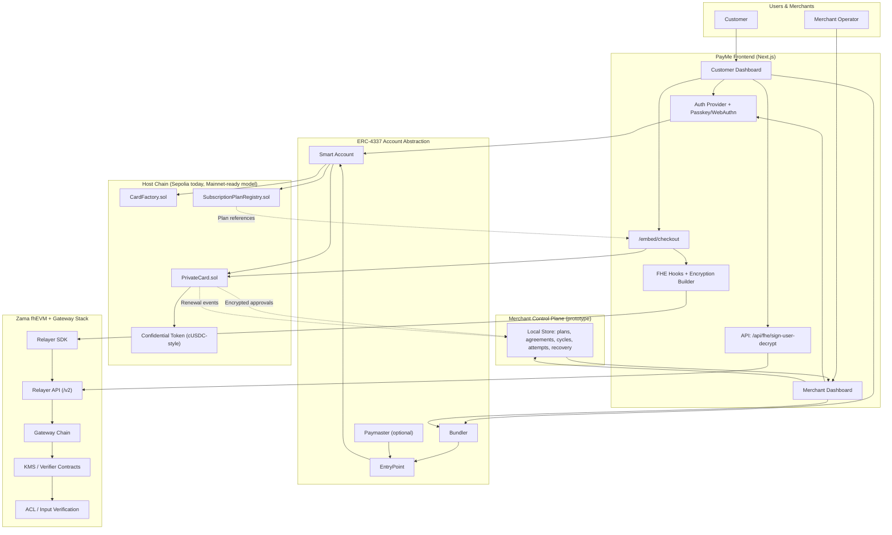

# PayMe

PayMe is a confidential subscription and payments protocol built with:

- ERC-4337 account abstraction for gas-abstracted smart wallet UX
- WebAuthn passkeys for user authentication and wallet control
- Zama FHEVM for encrypted balances, encrypted approvals, and private payment execution
- Merchant subscription orchestration with customer-first privacy guarantees

The project is designed as a contest-grade prototype showing end-to-end private recurring payments, from user onboarding to merchant billing and recovery.

## What This Project Includes

- Passkey-secured smart account onboarding
- Private card contracts per user (`PrivateCard`)
- Encrypted recurring subscription approvals
- Merchant billing cycles, retry flows, and recovery queue
- On-chain plan registry plus local merchant control plane metadata
- Embedded checkout flow for customer subscription approval

## Core Technologies

- `ERC-4337` (`EntryPoint`, `UserOperation`, bundler/paymaster-compatible flow)
- `WebAuthn` / passkeys for keyless user signing UX
- `Zama fhEVM` and relayer SDK for encrypted input and decrypt workflows
- `Hardhat` for deployment and contract testing
- `Next.js` frontend and API routes for UX + relayer-side helpers

## Repository Structure

- [README.md](/home/zoe/Documents/zama/PayMe/README.md) - root overview (this file)
- [frontend/README.md](/home/zoe/Documents/zama/PayMe/frontend/README.md) - frontend app details
- [hardhat/README.md](/home/zoe/Documents/zama/PayMe/hardhat/README.md) - contracts and deployment
- [docs/mainnet.md](/home/zoe/Documents/zama/PayMe/docs/mainnet.md) - Sepolia vs mainnet fhEVM flow
- [docs/smart-wallet-funding-flows.md](/home/zoe/Documents/zama/PayMe/docs/smart-wallet-funding-flows.md) - wallet funding flows
- [docs/database-plan.md](/home/zoe/Documents/zama/PayMe/docs/database-plan.md) - production data direction

## System Components

Frontend and App Layer:

- Next.js app and dashboard surfaces
- Customer flows: onboarding, wallet, encrypted balance, subscriptions
- Merchant flows: plans, subscriptions, billing cycles, recovery
- Embedded checkout route for approval and first charge flow

Smart Contract Layer:

- `PrivateCard.sol` - encrypted balances/transfers/subscription approval and renewal
- `CardFactory.sol` - one card deployment per customer
- `SubscriptionPlanRegistry.sol` - merchant plan publication and references
- ERC-4337 account stack and entrypoint integration

FHE / Relayer Layer:

- Browser encryption input generation
- Relayer SDK initialization and instance creation
- User decrypt signature helper route
- Gateway/KMS relay path for decrypt and verification flows

## Full Architecture Graph



## End-To-End Flow

### 1. Customer Onboarding and Card Setup

1. User creates/links a passkey identity.
2. A smart account is initialized under ERC-4337.
3. `CardFactory` deploys a user `PrivateCard`.
4. Card is associated with encrypted token flow and ACL path.

### 2. Subscription Approval and Initial Charge

1. Merchant publishes plan metadata and plan reference.
2. Customer enters embedded checkout.
3. Amount/limits are encrypted client-side via relayer SDK.
4. App submits an ERC-4337 user operation to call card subscription methods.
5. Contract stores encrypted approval and executes initial payment logic.

### 3. Merchant Renewal and Recovery

1. Merchant dashboard tracks due subscriptions and billing cycles.
2. Renewal pulls execute against approved subscription refs.
3. Success/failure attempts are recorded.
4. Past-due agreements move into recovery queue with retry policy.

## Contract Inventory

- [PrivateCard.sol](/home/zoe/Documents/zama/PayMe/hardhat/contracts/PrivateCard.sol)
- [CardFactory.sol](/home/zoe/Documents/zama/PayMe/hardhat/contracts/CardFactory.sol)
- [SubscriptionPlanRegistry.sol](/home/zoe/Documents/zama/PayMe/hardhat/contracts/SubscriptionPlanRegistry.sol)

## Frontend and SDK Integration Points

- [fhevm.ts](/home/zoe/Documents/zama/PayMe/frontend/src/lib/fhevm-sdk/internal/fhevm.ts) - fhEVM instance creation
- [RelayerSDKLoader.ts](/home/zoe/Documents/zama/PayMe/frontend/src/lib/fhevm-sdk/internal/RelayerSDKLoader.ts) - browser SDK loading
- [constants.ts](/home/zoe/Documents/zama/PayMe/frontend/src/lib/fhevm-sdk/internal/constants.ts) - SDK CDN pointer
- [route.ts](/home/zoe/Documents/zama/PayMe/frontend/src/app/api/fhe/sign-user-decrypt/route.ts) - decrypt signature route
- [page.tsx](/home/zoe/Documents/zama/PayMe/frontend/src/app/embed/checkout/page.tsx) - embedded checkout

## Quick Start

### 1. Contracts

```bash
cd hardhat
npm install
npx hardhat compile
npx hardhat run scripts/deploy_payme_core.ts --network sepolia
```

### 2. Frontend

```bash
cd frontend
npm install
npm run dev
```

### 3. Configure Environment

- set frontend chain/RPC and contract addresses
- set `RELAYER_PRIVATE_KEY` for user decrypt signing route
- verify bundler/entrypoint settings match deployed environment

Use [hardhat/README.md](/home/zoe/Documents/zama/PayMe/hardhat/README.md) and [frontend/README.md](/home/zoe/Documents/zama/PayMe/frontend/README.md) for concrete env variable lists.

## Mainnet Readiness Notes

The current prototype is Sepolia-first. Mainnet support requires:

- replacing Sepolia-specific SDK config and relayer endpoints
- mainnet contract deployments and address wiring
- production-grade backend persistence for merchant control plane
- infrastructure hardening for billing automation and observability

See [docs/mainnet.md](/home/zoe/Documents/zama/PayMe/docs/mainnet.md) for full migration details.

## Security and Scope

This is a prototype and contest submission, not a fully audited production system.

- contracts and cryptographic integrations should undergo external audits
- current merchant control plane persistence is prototype-grade
- operational key management and relayer trust assumptions must be hardened for production
