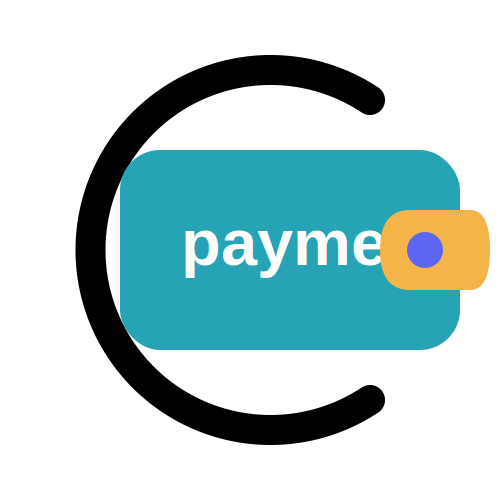
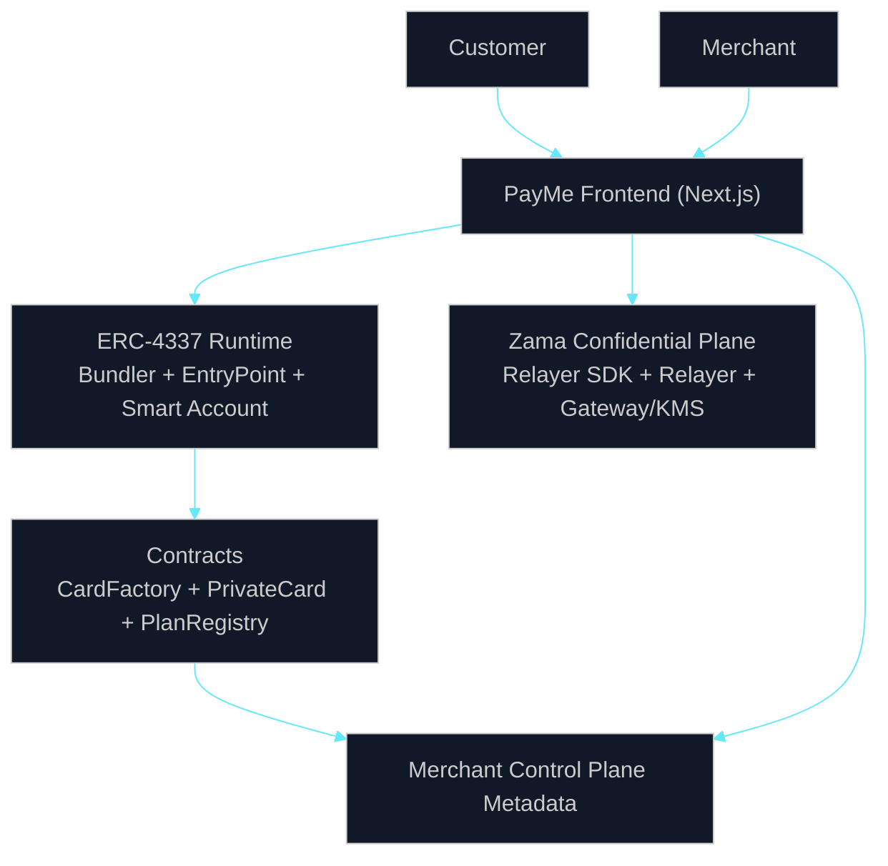
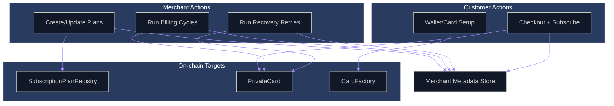

# PayMe

PayMe is a confidential subscription and payments protocol built with:

- ERC-4337 account abstraction for gas-abstracted smart wallet UX
- WebAuthn passkeys for user authentication and wallet control
- Zama FHEVM for encrypted balances, encrypted approvals, and private payment execution
- Merchant subscription orchestration with customer-first privacy guarantees

The project is designed as a contest-grade prototype showing end-to-end private recurring payments, from user onboarding to merchant billing and recovery.

## Table Of Contents

- [Why PayMe](#why-payme)
- [Project Evolution](#project-evolution)
- [What We Built](#what-we-built)
- [Core Technologies](#core-technologies)
- [Repository Structure](#repository-structure)
- [Architecture At A Glance](#architecture-at-a-glance)
- [Protocol Flow](#protocol-flow)
- [Component Interaction View](#component-interaction-view)
- [Detailed Architecture](#detailed-architecture)
- [Contract Design](#contract-design)
- [Data and State Model](#data-and-state-model)
- [Security and Trust Boundaries](#security-and-trust-boundaries)
- [End-To-End Flow](#end-to-end-flow)
- [Local Development](#local-development)
- [Mainnet Readiness Notes](#mainnet-readiness-notes)
- [Known Prototype Limits](#known-prototype-limits)
- [Roadmap](#roadmap)
- [References](#references)

## Why PayMe

Recurring payments in Web3 still have three major problems:

- poor wallet UX and key management for non-technical users
- no native privacy for subscription balances and spending limits
- weak merchant tooling for billing cycles and recovery workflows

PayMe addresses these by combining:

- passkey-based smart account onboarding
- account abstraction via ERC-4337 UserOperations
- confidential on-chain amount handling through Zama fhEVM
- merchant-side subscription control plane and recovery loops

## Project Evolution

This repository evolved in three concrete implementation steps:

1. Wallet and confidentiality foundation.
   Added passkey-enabled wallet UX, ERC-4337 execution path, and encrypted balance primitives.
2. Merchant subscription product layer.
   Added plan registry, embedded checkout, customer approval flow, and renewal charge path.
3. Operational merchant workflows.
   Added billing cycle execution, failure handling, and recovery queue to make recurring payments practical.

Current state in this repo:

- customer approval and merchant renewal flows are implemented
- checkout and merchant surfaces are integrated in the same app
- merchant operational state is currently prototype metadata (local storage)
- architecture is Sepolia-first with documented mainnet migration path

## What We Built

- confidential wallet and card UX for customers
- merchant portal for plans, subscriptions, billing cycles, and recovery
- embedded checkout for subscription approval and first charge
- encrypted subscription allowance model with on-chain enforcement
- CardFactory + PrivateCard + SubscriptionPlanRegistry contract suite
- relayer-assisted user decryption and encrypted input workflows

## What This Project Includes

- Passkey-secured smart account onboarding
- Private card contracts per user (`PrivateCard`)
- Encrypted recurring subscription approvals
- Merchant billing cycles, retry flows, and recovery queue
- On-chain plan registry plus local merchant control plane metadata
- Embedded checkout flow for customer subscription approval

## Core Technologies

- `ERC-4337` (`EntryPoint`, `UserOperation`, bundler/paymaster-compatible flow)
- `WebAuthn` / passkeys for keyless user signing UX
- `Zama fhEVM` and relayer SDK for encrypted input and decrypt workflows
- `Hardhat` for deployment and contract testing
- `Next.js` frontend and API routes for UX + relayer-side helpers

## Repository Structure

- [README.md](/home/zoe/Documents/zama/PayMe/README.md) - root overview (this file)
- [frontend/README.md](/home/zoe/Documents/zama/PayMe/frontend/README.md) - frontend app details
- [hardhat/README.md](/home/zoe/Documents/zama/PayMe/hardhat/README.md) - contracts and deployment
- [docs/mainnet.md](/home/zoe/Documents/zama/PayMe/docs/mainnet.md) - Sepolia vs mainnet fhEVM flow
- [docs/smart-wallet-funding-flows.md](/home/zoe/Documents/zama/PayMe/docs/smart-wallet-funding-flows.md) - wallet funding flows
- [docs/database-plan.md](/home/zoe/Documents/zama/PayMe/docs/database-plan.md) - production data direction

Primary implementation surfaces:

- `frontend/src/app` - customer + merchant route surfaces
- `frontend/src/lib/fhevm-sdk` - fhEVM integration wrapper and hooks
- `frontend/src/app/api/fhe/sign-user-decrypt/route.ts` - decryption signature route
- `hardhat/contracts` - protocol contracts
- `hardhat/deploy` and `hardhat/scripts` - deployment and wiring scripts

## System Components

Frontend and App Layer:

- Next.js app and dashboard surfaces
- Customer flows: onboarding, wallet, encrypted balance, subscriptions
- Merchant flows: plans, subscriptions, billing cycles, recovery
- Embedded checkout route for approval and first charge flow

Smart Contract Layer:

- `PrivateCard.sol` - encrypted balances/transfers/subscription approval and renewal
- `CardFactory.sol` - one card deployment per customer
- `SubscriptionPlanRegistry.sol` - merchant plan publication and references
- ERC-4337 account stack and entrypoint integration

FHE / Relayer Layer:

- Browser encryption input generation
- Relayer SDK initialization and instance creation
- User decrypt signature helper route
- Gateway/KMS relay path for decrypt and verification flows

Operational Layer:

- bundler submits ERC-4337 UserOperations
- optional paymaster model for sponsored gas path
- deployment scripts for contract address propagation
- environment-configured chain, relayer, and contract endpoints

## Architecture At A Glance



- Privacy boundary: plaintext amounts stay client-side; encrypted handles/proofs are used for execution.
- Authorization boundary: customer approves subscription mandate once; renewal execution follows contract rules.
- Settlement boundary: ERC-4337 handles transaction orchestration; FHE/Gateway handles encrypted compute lifecycle.

## Protocol Flow

```mermaid
%%{init: {'theme':'dark', 'themeVariables': { 'primaryColor':'#0ea5e9', 'primaryTextColor':'#ffffff', 'primaryBorderColor':'#0284c7', 'lineColor':'#38bdf8', 'secondaryColor':'#1e293b', 'tertiaryColor':'#334155', 'background':'#0b1220', 'mainBkg':'#111827', 'secondBkg':'#1f2937', 'labelBackground':'#1f2937', 'labelTextColor':'#ffffff', 'actorBkg':'#111827', 'actorBorder':'#0ea5e9', 'actorTextColor':'#ffffff', 'signalColor':'#38bdf8', 'signalTextColor':'#ffffff'}}}%%
sequenceDiagram
    participant User as Customer
    participant Merchant as Merchant Operator
    participant UI as PayMe Frontend
    participant SDK as Zama Relayer SDK
    participant AA as ERC-4337 (Bundler+EntryPoint)
    participant Registry as SubscriptionPlanRegistry
    participant Card as PrivateCard
    participant CP as Merchant Metadata Store

    rect rgb(38,38,68)
        Note over Merchant,Registry: STEP 0 · Merchant creates plan
        Merchant->>UI: Create/Update plan terms
        UI->>AA: submit UserOperation for plan publish
        AA->>Registry: register/update plan reference
        UI->>CP: store plan metadata and status
    end

    rect rgb(20,40,70)
        Note over User,Card: STEP 1 · Customer wallet and card setup
        User->>UI: Register/Login with passkey
        UI->>AA: Deploy/initialize smart account (if needed)
        UI->>Card: Create card via CardFactory
        Card-->>UI: cardAddress + ownership context
    end

    rect rgb(20,70,45)
        Note over User,Card: STEP 2 · Subscription approval and first charge
        Merchant->>UI: Share checkout link with plan reference
        User->>UI: Open checkout link
        UI->>SDK: Encrypt allowance/amount
        SDK-->>UI: handles + inputProof
        UI->>AA: submit UserOperation for subscribe + initial charge
        AA->>Card: execute card subscription call
        UI->>CP: register agreement and cycle metadata
    end

    rect rgb(70,45,20)
        Note over Merchant,CP: STEP 3 · Merchant billing and recovery
        Merchant->>UI: Open billing/recovery view
        UI->>CP: compute due subscriptions and retry queue
        Merchant->>UI: Trigger due charges
        UI->>AA: submit renewal UserOperation(s)
        AA->>Card: renewal pull against approved refs
        UI->>CP: save success/failure attempts
        Merchant->>UI: Retry failed items
        UI->>AA: submit retry UserOperation(s)
    end
```



## Component Interaction View



## Detailed Architecture

### 1. User Identity and Wallet Control

- user authentication is passkey-driven through WebAuthn
- passkey context is used to control smart account actions
- account abstraction enables programmable signing and execution policies
- no seed phrase-first UX is required for baseline usage

### 2. Account Abstraction Execution Plane

- frontend prepares UserOperation payloads
- bundler handles UserOp inclusion via `EntryPoint`
- smart account executes downstream calls to protocol contracts
- paymaster integration is optional and can sponsor transaction costs

This separation keeps UX logic in the app layer and execution guarantees in the ERC-4337 stack.

### 3. Confidential Compute Plane (Zama)

- client-side encrypted inputs are created via relayer SDK
- proof + handle payloads are submitted to contract methods
- decrypt requests are handled through relayer/gateway verification path
- app includes a helper API route for user-decrypt typed-data signatures

This preserves confidentiality of balances and limits while retaining verifiable execution on-chain.

### 4. Contract Plane

- `CardFactory` is responsible for deterministic lifecycle of user cards
- `PrivateCard` is the core confidential payment primitive
- `SubscriptionPlanRegistry` provides merchant plan references and ownership
- confidential token mechanics are consumed through contract integration points

### 5. Merchant Control Plane

- manages plans, subscriptions, billing cycles, attempts, and recovery state
- computes due work, retries, and at-risk subscriptions
- currently prototype-grade and local metadata-driven
- designed to be migrated to durable backend persistence

## Contract Design

### PrivateCard Responsibilities

- hold/manage confidential token logic integration
- store customer subscription approvals and refs
- execute merchant renewal pulls within authorization constraints
- emit events to support merchant-side state reconciliation

### CardFactory Responsibilities

- deploy and map user card instances
- enforce one-card-per-user design assumptions when configured
- expose lookup functions for UI/service resolution

### SubscriptionPlanRegistry Responsibilities

- register merchant plan records and references
- anchor plan identity on-chain
- support checkout validation and merchant plan mapping

## Data and State Model

On-chain state:

- card ownership and authorization context
- encrypted subscription authorization artifacts
- plan registration metadata and refs
- renewal execution events and settlement traces

Frontend/app state:

- session state and user identity context
- dashboard projections from contract reads
- merchant operational metadata for billing and recovery

Control plane state (prototype):

- plan templates
- customer agreements
- billing cycles
- billing attempts
- retry and recovery indicators
- activity timeline items

## Security and Trust Boundaries

### Boundary A: User Auth vs Execution

- passkeys authenticate user intent
- smart accounts enforce execution permissions
- `EntryPoint` path enforces ERC-4337 validation model

### Boundary B: Confidentiality vs Availability

- amounts/limits are encrypted before on-chain submission
- relayer/gateway path is required for decrypt workflows
- service availability of relayer components impacts user experience

### Boundary C: Merchant Operations vs Customer Authorization

- customer gives subscription authorization once per agreement
- merchant-side renewals must satisfy contract constraints
- recovery actions are tracked separately from authorization state

### Boundary D: Prototype Metadata vs Canonical Ledger

- canonical funds/state transitions are on-chain
- merchant operational metadata is local in prototype mode
- production migration requires durable backend + reconciliation services

## End-To-End Flow

### 1. Customer Onboarding and Card Setup

1. User creates/links a passkey identity.
2. A smart account is initialized under ERC-4337.
3. `CardFactory` deploys a user `PrivateCard`.
4. Card is associated with encrypted token flow and ACL path.

### 2. Subscription Approval and Initial Charge

1. Merchant publishes plan metadata and plan reference.
2. Customer enters embedded checkout.
3. Amount/limits are encrypted client-side via relayer SDK.
4. App submits an ERC-4337 user operation to call card subscription methods.
5. Contract stores encrypted approval and executes initial payment logic.

### 3. Merchant Renewal and Recovery

1. Merchant dashboard tracks due subscriptions and billing cycles.
2. Renewal pulls execute against approved subscription refs.
3. Success/failure attempts are recorded.
4. Past-due agreements move into recovery queue with retry policy.

## Contract Inventory

- [PrivateCard.sol](/home/zoe/Documents/zama/PayMe/hardhat/contracts/PrivateCard.sol)
- [CardFactory.sol](/home/zoe/Documents/zama/PayMe/hardhat/contracts/CardFactory.sol)
- [SubscriptionPlanRegistry.sol](/home/zoe/Documents/zama/PayMe/hardhat/contracts/SubscriptionPlanRegistry.sol)

## Frontend and SDK Integration Points

- [fhevm.ts](/home/zoe/Documents/zama/PayMe/frontend/src/lib/fhevm-sdk/internal/fhevm.ts) - fhEVM instance creation
- [RelayerSDKLoader.ts](/home/zoe/Documents/zama/PayMe/frontend/src/lib/fhevm-sdk/internal/RelayerSDKLoader.ts) - browser SDK loading
- [constants.ts](/home/zoe/Documents/zama/PayMe/frontend/src/lib/fhevm-sdk/internal/constants.ts) - SDK CDN pointer
- [route.ts](/home/zoe/Documents/zama/PayMe/frontend/src/app/api/fhe/sign-user-decrypt/route.ts) - decrypt signature route
- [page.tsx](/home/zoe/Documents/zama/PayMe/frontend/src/app/embed/checkout/page.tsx) - embedded checkout

## Local Development

### 1. Contracts

```bash
cd hardhat
npm install
npx hardhat compile
npx hardhat run scripts/deploy_payme_core.ts --network sepolia
```

### 2. Frontend

```bash
cd frontend
npm install
npm run dev
```

### 3. Configure Environment

- set frontend chain/RPC and contract addresses
- set `RELAYER_PRIVATE_KEY` for user decrypt signing route
- verify bundler/entrypoint settings match deployed environment

Use [hardhat/README.md](/home/zoe/Documents/zama/PayMe/hardhat/README.md) and [frontend/README.md](/home/zoe/Documents/zama/PayMe/frontend/README.md) for concrete env variable lists.

### 4. Validate End-To-End

Suggested local validation path:

1. create merchant account and customer account
2. deploy/verify card creation flow for customer
3. create merchant plan and open checkout link
4. approve subscription with encrypted input flow
5. run at least one renewal and inspect cycle/attempt state
6. validate decrypt-enabled balance views and error handling

## Mainnet Readiness Notes

The current prototype is Sepolia-first. Mainnet support requires:

- replacing Sepolia-specific SDK config and relayer endpoints
- mainnet contract deployments and address wiring
- production-grade backend persistence for merchant control plane
- infrastructure hardening for billing automation and observability

See [docs/mainnet.md](/home/zoe/Documents/zama/PayMe/docs/mainnet.md) for full migration details.

## Known Prototype Limits

- no full external security audit completed
- merchant control plane persistence is currently prototype-grade
- limited production-grade observability and reconciliation services
- relayer and key-management hardening required before production launch

## Roadmap

1. network-aware fhEVM config abstraction (Sepolia/mainnet)
2. durable merchant backend and reconciliation workers
3. automated billing worker model with queue and retry policy controls
4. stronger monitoring, error budgets, and operational playbooks
5. external security review for contracts and signing flows

## References

- [frontend/README.md](/home/zoe/Documents/zama/PayMe/frontend/README.md)
- [hardhat/README.md](/home/zoe/Documents/zama/PayMe/hardhat/README.md)
- [docs/mainnet.md](/home/zoe/Documents/zama/PayMe/docs/mainnet.md)
- [docs/database-plan.md](/home/zoe/Documents/zama/PayMe/docs/database-plan.md)
- [docs/smart-wallet-funding-flows.md](/home/zoe/Documents/zama/PayMe/docs/smart-wallet-funding-flows.md)
