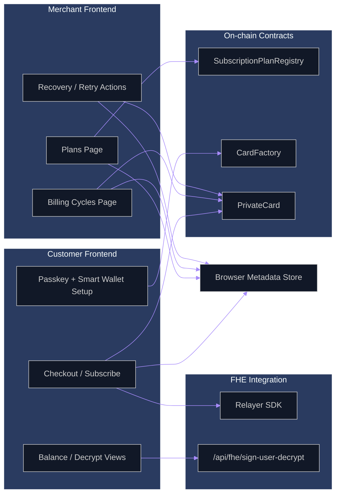

<p align="center">
  
</p>

# PayMe

PayMe is a private subscription and payments system built on ERC-4337 account abstraction, WebAuthn passkeys, and Zama fhEVM.

This repository contains the frontend application, smart contracts, deployment scripts, and supporting documentation for the current prototype.

## Table Of Contents

- [Project Overview](#project-overview)
- [Implementation Status](#implementation-status)
- [System Scope](#system-scope)
- [Core Technologies](#core-technologies)
- [Repository Structure](#repository-structure)
- [Personas and Use Cases](#personas-and-use-cases)
- [Protocol Flow](#protocol-flow)
- [Component Interaction View](#component-interaction-view)
- [Detailed Architecture](#detailed-architecture)
- [Contract Design](#contract-design)
- [Data and State Model](#data-and-state-model)
- [Merchant Subscription Operations](#merchant-subscription-operations)
- [API Surface](#api-surface)
- [Security and Trust Boundaries](#security-and-trust-boundaries)
- [End-To-End Flow](#end-to-end-flow)
- [Getting Started](#getting-started)
- [Local Development](#local-development)
- [Testing](#testing)
- [Developer Workflow](#developer-workflow)
- [Technical Notes](#technical-notes)
- [Mainnet Readiness Notes](#mainnet-readiness-notes)
- [References](#references)

## Project Overview

PayMe covers the recurring payment flow for a customer and a merchant:

- customer wallet onboarding with passkeys
- encrypted subscription approval and first charge
- merchant plan creation and recurring billing execution
- billing failure tracking and retry/recovery handling

The current codebase is split across:

- `frontend` for customer and merchant routes
- `hardhat` for smart contracts and deployment
- `docs` for network and operational notes
- `frontend/src/lib/fhevm-sdk` for the fhEVM integration layer

## Implementation Status

Current implementation status in this repository:

- customer approval and merchant renewal flows are implemented
- merchant plan, billing, and recovery screens exist in the frontend
- the embedded checkout route is implemented
- the merchant control plane is still prototype metadata
- Sepolia is the current active network target

## System Scope

This repository includes:

- passkey-secured smart account onboarding
- `PrivateCard` deployment and subscription approval flow
- merchant plan registration and billing cycle execution
- encrypted input handling through the relayer SDK
- local merchant metadata for agreements, attempts, and recovery

## Core Technologies

- `ERC-4337` (`EntryPoint`, `UserOperation`, bundler/paymaster-compatible flow)
- `WebAuthn` / passkeys for keyless user signing UX
- `Zama fhEVM` and relayer SDK for encrypted input and decrypt workflows
- `Hardhat` for deployment and contract testing
- `Next.js` frontend and API routes for UX + relayer-side helpers

## Repository Structure

- [README.md](/home/zoe/Documents/zama/PayMe/README.md) - root overview (this file)
- [frontend/README.md](/home/zoe/Documents/zama/PayMe/frontend/README.md) - frontend app details
- [hardhat/README.md](/home/zoe/Documents/zama/PayMe/hardhat/README.md) - contracts and deployment
- [docs/mainnet.md](/home/zoe/Documents/zama/PayMe/docs/mainnet.md) - Sepolia vs mainnet fhEVM flow
- [docs/smart-wallet-funding-flows.md](/home/zoe/Documents/zama/PayMe/docs/smart-wallet-funding-flows.md) - wallet funding flows
- [docs/database-plan.md](/home/zoe/Documents/zama/PayMe/docs/database-plan.md) - production data direction

Primary implementation surfaces:

- `frontend/src/app` - customer + merchant route surfaces
- `frontend/src/lib/fhevm-sdk` - fhEVM integration wrapper and hooks
- `frontend/src/app/api/fhe/sign-user-decrypt/route.ts` - decryption signature route
- `hardhat/contracts` - protocol contracts
- `hardhat/deploy` and `hardhat/scripts` - deployment and wiring scripts

## Personas and Use Cases

Primary personas:

- customer who wants private wallet balances and private subscription approvals
- merchant who needs recurring billing and retry/recovery operations
- protocol operator/developer who needs deterministic contract and deployment behavior

Main use cases supported in this repo:

1. customer creates passkey-linked smart account and private card
2. merchant creates plan and shares checkout reference
3. customer approves encrypted subscription and executes first payment
4. merchant runs renewal charges for due subscriptions
5. merchant reviews failures and retries at-risk agreements
6. customer and merchant inspect activity and balances with privacy-preserving flows

## System Components

Frontend and App Layer:

- Next.js app and dashboard surfaces
- Customer flows: onboarding, wallet, encrypted balance, subscriptions
- Merchant flows: plans, subscriptions, billing cycles, recovery
- Embedded checkout route for approval and first charge flow

Smart Contract Layer:

- `PrivateCard.sol` - encrypted balances/transfers/subscription approval and renewal
- `CardFactory.sol` - one card deployment per customer
- `SubscriptionPlanRegistry.sol` - merchant plan publication and references
- ERC-4337 account stack and entrypoint integration

FHE / Relayer Layer:

- Browser encryption input generation
- Relayer SDK initialization and instance creation
- User decrypt signature helper route
- Gateway/KMS relay path for decrypt and verification flows

Operational Layer:

- bundler submits ERC-4337 UserOperations
- optional paymaster model for sponsored gas path
- deployment scripts for contract address propagation
- environment-configured chain, relayer, and contract endpoints

## Protocol Flow

```mermaid
%%{init: {'theme':'dark', 'themeVariables': { 'primaryColor':'#0ea5e9', 'primaryTextColor':'#ffffff', 'primaryBorderColor':'#0284c7', 'lineColor':'#38bdf8', 'secondaryColor':'#1e293b', 'tertiaryColor':'#334155', 'background':'#0b1220', 'mainBkg':'#111827', 'secondBkg':'#1f2937', 'labelBackground':'#1f2937', 'labelTextColor':'#ffffff', 'actorBkg':'#111827', 'actorBorder':'#0ea5e9', 'actorTextColor':'#ffffff', 'signalColor':'#38bdf8', 'signalTextColor':'#ffffff'}}}%%
sequenceDiagram
    participant User as Customer
    participant Merchant as Merchant Operator
    participant App as PayMe App Frontend
    participant MUI as Merchant Frontend
    participant Checkout as /embed/checkout
    participant SDK as Zama Relayer SDK
    participant AA as Smart Wallet + Bundler
    participant Registry as SubscriptionPlanRegistry
    participant Factory as CardFactory
    participant Card as PrivateCard
    participant CP as Browser Metadata Store

    rect rgb(38,38,68)
        Note over Merchant,Registry: STEP 0 · Merchant creates plan
        Merchant->>MUI: Create/Update plan terms
        MUI->>AA: submit UserOperation for plan publish
        AA->>Registry: register/update plan reference
        MUI->>CP: store local plan metadata
    end

    rect rgb(20,40,70)
        Note over User,Card: STEP 1 · Customer wallet and card setup
        User->>App: Register/Login with passkey
        App->>AA: deploy/initialize smart account
        AA->>Factory: createCard()
        Factory-->>Card: deploy customer card
        Card-->>App: cardAddress + ownership context
    end

    rect rgb(20,70,45)
        Note over User,Card: STEP 2 · Subscription approval and first charge
        Merchant->>MUI: Share checkout link
        User->>Checkout: Open merchant checkout
        Checkout->>SDK: encrypt amount/allowance
        SDK-->>Checkout: handles + inputProof
        Checkout->>AA: submit UserOperation
        AA->>Card: execute card subscription call
        Checkout->>CP: register agreement and first cycle metadata
    end

    rect rgb(70,45,20)
        Note over Merchant,CP: STEP 3 · Merchant billing and recovery
        Merchant->>MUI: Open billing/recovery view
        MUI->>CP: read due subscriptions and retry queue
        Merchant->>MUI: Trigger due charges or retries
        MUI->>AA: submit renewal UserOperation(s)
        AA->>Card: chargeSubscriptionRefRenewal() or pullSubscriptionWithProof()
        MUI->>CP: save attempt results and next cycle state
    end
```



Implementation notes for this flow:

- `SubscriptionPlanRegistry` stores merchant plan references on-chain.
- merchant operational state is stored in the browser control-plane store, not a server database.
- checkout approval is handled by [`page.tsx`](/home/zoe/Documents/zama/PayMe/frontend/src/app/embed/checkout/page.tsx).
- billing/retry execution is handled by [`page.tsx`](/home/zoe/Documents/zama/PayMe/frontend/src/app/merchant/billing-cycles/page.tsx).

## Component Interaction View



This view reflects the current repo layout:

- merchant pages update both on-chain plan/card state and local metadata
- customer checkout touches the relayer SDK and then writes agreement metadata locally after success
- the decrypt-signing API route supports balance/decrypt flows, not merchant plan creation

## Detailed Architecture

### 1. User Identity and Wallet Control

- user authentication is passkey-driven through WebAuthn
- passkey context is used to control smart account actions
- account abstraction enables programmable signing and execution policies
- no seed phrase-first UX is required for baseline usage

### 2. Account Abstraction Execution Plane

- frontend prepares UserOperation payloads
- bundler handles UserOp inclusion via `EntryPoint`
- smart account executes downstream calls to protocol contracts
- paymaster integration is optional and can sponsor transaction costs

This separation keeps UX logic in the app layer and execution guarantees in the ERC-4337 stack.

### 3. Confidential Compute Plane (Zama)

- client-side encrypted inputs are created via relayer SDK
- proof + handle payloads are submitted to contract methods
- decrypt requests are handled through relayer/gateway verification path
- app includes a helper API route for user-decrypt typed-data signatures

This preserves confidentiality of balances and limits while retaining verifiable execution on-chain.

### 4. Contract Plane

- `CardFactory` is responsible for deterministic lifecycle of user cards
- `PrivateCard` is the core confidential payment primitive
- `SubscriptionPlanRegistry` provides merchant plan references and ownership
- confidential token mechanics are consumed through contract integration points

### 5. Merchant Control Plane

- manages plans, subscriptions, billing cycles, attempts, and recovery state
- computes due work, retries, and at-risk subscriptions
- currently prototype-grade and local metadata-driven
- designed to be migrated to durable backend persistence

## Contract Design

### PrivateCard Responsibilities

- hold/manage confidential token logic integration
- store customer subscription approvals and refs
- execute merchant renewal pulls within authorization constraints
- emit events to support merchant-side state reconciliation

### CardFactory Responsibilities

- deploy and map user card instances
- enforce one-card-per-user design assumptions when configured
- expose lookup functions for UI/service resolution

### SubscriptionPlanRegistry Responsibilities

- register merchant plan records and references
- anchor plan identity on-chain
- support checkout validation and merchant plan mapping

## Data and State Model

On-chain state:

- card ownership and authorization context
- encrypted subscription authorization artifacts
- plan registration metadata and refs
- renewal execution events and settlement traces

Frontend/app state:

- session state and user identity context
- dashboard projections from contract reads
- merchant operational metadata for billing and recovery

Control plane state (prototype):

- plan templates
- customer agreements
- billing cycles
- billing attempts
- retry and recovery indicators
- activity timeline items

## Merchant Subscription Operations

Operational model implemented in this prototype:

1. Plan management.
   Merchant creates/updates plan template and plan references used by checkout.
2. Agreement registration.
   After customer approval, merchant-side metadata stores agreement and cycle baseline.
3. Billing execution.
   Merchant billing views compute due agreements and submit renewal execution.
4. Attempt recording.
   Success/failure is tracked per cycle with attempt-level records.
5. Recovery workflow.
   Failed agreements move to recovery queue for retry according to policy.
6. State visibility.
   Merchant dashboard surfaces active, past-due, and recovery-at-risk indicators.

Why this matters:

- gives a Stripe-like operational mental model for subscriptions
- keeps confidential payment authorization on-chain
- preserves merchant-grade observability even in prototype mode

## API Surface

Application API routes currently used in core flow:

- [`/api/fhe/sign-user-decrypt`](/home/zoe/Documents/zama/PayMe/frontend/src/app/api/fhe/sign-user-decrypt/route.ts)
  - returns signer address and signs typed-data payloads for user decrypt requests
- [`/api/users/save`](/home/zoe/Documents/zama/PayMe/frontend/src/app/api/users/save/route.ts)
  - persists user-linked account metadata path used by app workflows
- [`/api/users/topup`](/home/zoe/Documents/zama/PayMe/frontend/src/app/api/users/topup/route.ts)
  - utility path for test/development funding operations
- [`/api/debug/deploy`](/home/zoe/Documents/zama/PayMe/frontend/src/app/api/debug/deploy/route.ts)
  - debug visibility into deployment/environment wiring status

Core client integration points:

- [`frontend/src/app/embed/checkout/page.tsx`](/home/zoe/Documents/zama/PayMe/frontend/src/app/embed/checkout/page.tsx)
- [`frontend/src/lib/fhevm-sdk/internal/fhevm.ts`](/home/zoe/Documents/zama/PayMe/frontend/src/lib/fhevm-sdk/internal/fhevm.ts)
- [`frontend/src/lib/fhevm-sdk/react/useFHEEncryption.ts`](/home/zoe/Documents/zama/PayMe/frontend/src/lib/fhevm-sdk/react/useFHEEncryption.ts)
- [`frontend/src/lib/merchant/control-plane-store.ts`](/home/zoe/Documents/zama/PayMe/frontend/src/lib/merchant/control-plane-store.ts)

## Security and Trust Boundaries

### Boundary A: User Auth vs Execution

- passkeys authenticate user intent
- smart accounts enforce execution permissions
- `EntryPoint` path enforces ERC-4337 validation model

### Boundary B: Confidentiality vs Availability

- amounts/limits are encrypted before on-chain submission
- relayer/gateway path is required for decrypt workflows
- service availability of relayer components impacts user experience

### Boundary C: Merchant Operations vs Customer Authorization

- customer gives subscription authorization once per agreement
- merchant-side renewals must satisfy contract constraints
- recovery actions are tracked separately from authorization state

### Boundary D: Prototype Metadata vs Canonical Ledger

- canonical funds/state transitions are on-chain
- merchant operational metadata is local in prototype mode
- production migration requires durable backend + reconciliation services

## End-To-End Flow

### 1. Customer Onboarding and Card Setup

1. User creates/links a passkey identity.
2. A smart account is initialized under ERC-4337.
3. `CardFactory` deploys a user `PrivateCard`.
4. Card is associated with encrypted token flow and ACL path.

### 2. Subscription Approval and Initial Charge

1. Merchant publishes plan metadata and plan reference.
2. Customer enters embedded checkout.
3. Amount/limits are encrypted client-side via relayer SDK.
4. App submits an ERC-4337 user operation to call card subscription methods.
5. Contract stores encrypted approval and executes initial payment logic.

### 3. Merchant Renewal and Recovery

1. Merchant dashboard tracks due subscriptions and billing cycles.
2. Renewal pulls execute against approved subscription refs.
3. Success/failure attempts are recorded.
4. Past-due agreements move into recovery queue with retry policy.

## Getting Started

### Prerequisites

- Node.js `20+`
- npm `7+`
- a Sepolia RPC provider key
- a funded Sepolia deployer key if you want to deploy contracts
- access to a bundler endpoint compatible with your frontend configuration

### Clone The Repository

```bash
git clone https://github.com/tekuuu/PayMe.git
cd PayMe
```

### Install Dependencies

This repository currently uses separate package installs for the frontend and Hardhat workspaces.

```bash
cd hardhat
npm install

cd ../frontend
npm install
```

### Configure Environment Files

Contract workspace:

- create or update `hardhat/.env`
- set `INFURA_API_KEY`
- set `PRIVATE_KEY`
- set any wrapper/token addresses required by the deployment scripts

Frontend workspace:

- create or update `frontend/.env.local`
- set `NEXT_PUBLIC_RPC_ENDPOINT`
- set `NEXT_PUBLIC_BUNDLER_URL`
- set deployed contract addresses
- set `RELAYER_PRIVATE_KEY` for the decrypt-signing route

For the current expected variables, use:

- [frontend/README.md](/home/zoe/Documents/zama/PayMe/frontend/README.md)
- [hardhat/README.md](/home/zoe/Documents/zama/PayMe/hardhat/README.md)

## Contract Inventory

- [PrivateCard.sol](/home/zoe/Documents/zama/PayMe/hardhat/contracts/PrivateCard.sol)
- [CardFactory.sol](/home/zoe/Documents/zama/PayMe/hardhat/contracts/CardFactory.sol)
- [SubscriptionPlanRegistry.sol](/home/zoe/Documents/zama/PayMe/hardhat/contracts/SubscriptionPlanRegistry.sol)

## Frontend and SDK Integration Points

- [fhevm.ts](/home/zoe/Documents/zama/PayMe/frontend/src/lib/fhevm-sdk/internal/fhevm.ts) - fhEVM instance creation
- [RelayerSDKLoader.ts](/home/zoe/Documents/zama/PayMe/frontend/src/lib/fhevm-sdk/internal/RelayerSDKLoader.ts) - browser SDK loading
- [constants.ts](/home/zoe/Documents/zama/PayMe/frontend/src/lib/fhevm-sdk/internal/constants.ts) - SDK CDN pointer
- [route.ts](/home/zoe/Documents/zama/PayMe/frontend/src/app/api/fhe/sign-user-decrypt/route.ts) - decrypt signature route
- [page.tsx](/home/zoe/Documents/zama/PayMe/frontend/src/app/embed/checkout/page.tsx) - embedded checkout

## Local Development

### 1. Compile Contracts

```bash
cd hardhat
npx hardhat compile
```

### 2. Deploy Contracts If Needed

```bash
cd hardhat
npx hardhat run scripts/deploy_payme_core.ts --network sepolia
```

After deployment, propagate the relevant addresses into `frontend/.env.local`.

### 3. Start The Frontend

```bash
cd frontend
npm run dev
```

### 4. Validate End-To-End

Suggested local validation path:

1. create merchant account and customer account
2. deploy/verify card creation flow for customer
3. create merchant plan and open checkout link
4. approve subscription with encrypted input flow
5. run at least one renewal and inspect cycle/attempt state
6. validate decrypt-enabled balance views and error handling

## Testing

Current project-level test commands:

Contracts:

```bash
cd hardhat
npm test
```

Useful contract commands:

```bash
cd hardhat
npx hardhat compile
npx hardhat coverage
```

Notes:

- the Hardhat workspace now has `unit` and `integration` test directories
- fhEVM-heavy flows require the Hardhat fhEVM plugin and mock environment to be available
- some private-payment execution paths depend on ACL-sensitive encrypted handles, so integration tests should focus on stable contract behavior and explicit permissioned flows

## Developer Workflow

Recommended workflow for contributors:

1. read this root README, then the workspace README you are modifying
2. compile the Hardhat workspace before changing contract interfaces
3. keep frontend contract addresses and ABI expectations aligned with contract changes
4. test merchant flow changes against both customer and merchant routes
5. document any new environment variables or deployment assumptions in the relevant README

When changing contracts:

- check [hardhat/contracts/PrivateCard.sol](/home/zoe/Documents/zama/PayMe/hardhat/contracts/PrivateCard.sol)
- review deployment scripts under [hardhat/scripts](/home/zoe/Documents/zama/PayMe/hardhat/scripts)
- verify frontend usage in [frontend/src/app/embed/checkout/page.tsx](/home/zoe/Documents/zama/PayMe/frontend/src/app/embed/checkout/page.tsx) and related hooks

When changing frontend confidential flows:

- review [frontend/src/lib/fhevm-sdk/internal/fhevm.ts](/home/zoe/Documents/zama/PayMe/frontend/src/lib/fhevm-sdk/internal/fhevm.ts)
- review [frontend/src/hooks/use-confidential-token-balance.ts](/home/zoe/Documents/zama/PayMe/frontend/src/hooks/use-confidential-token-balance.ts)
- review [frontend/src/app/api/fhe/sign-user-decrypt/route.ts](/home/zoe/Documents/zama/PayMe/frontend/src/app/api/fhe/sign-user-decrypt/route.ts)

## Technical Notes

Important implementation notes for new developers:

- the merchant control plane is currently local metadata, not a durable backend ledger
- the frontend and contracts are tightly coupled through deployed addresses and checkout assumptions
- the active network target is Sepolia, with mainnet migration notes documented separately
- fhEVM flows require careful ACL handling when moving encrypted values across contracts
- the root README is the overview; the workspace READMEs contain lower-level setup details

## Mainnet Readiness Notes

The current prototype is Sepolia-first. Mainnet support requires:

- replacing Sepolia-specific SDK config and relayer endpoints
- mainnet contract deployments and address wiring
- production-grade backend persistence for merchant control plane
- infrastructure hardening for billing automation and observability

See [docs/mainnet.md](/home/zoe/Documents/zama/PayMe/docs/mainnet.md) for full migration details.

## References

- [frontend/README.md](/home/zoe/Documents/zama/PayMe/frontend/README.md)
- [hardhat/README.md](/home/zoe/Documents/zama/PayMe/hardhat/README.md)
- [docs/mainnet.md](/home/zoe/Documents/zama/PayMe/docs/mainnet.md)
- [docs/database-plan.md](/home/zoe/Documents/zama/PayMe/docs/database-plan.md)
- [docs/smart-wallet-funding-flows.md](/home/zoe/Documents/zama/PayMe/docs/smart-wallet-funding-flows.md)
